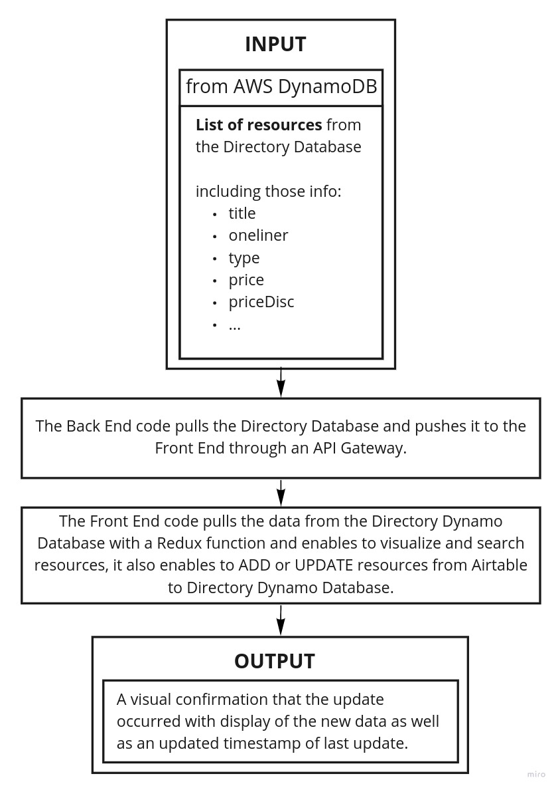
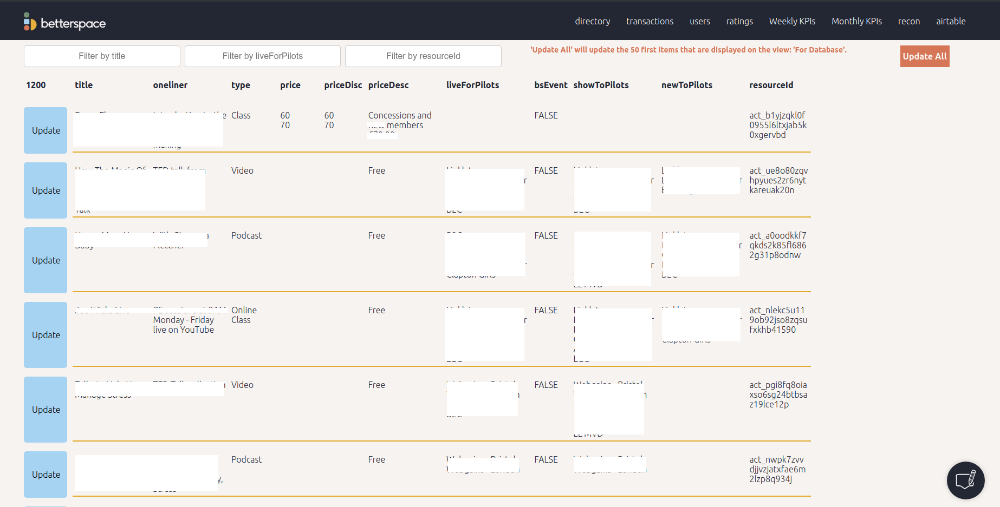

# AirtableToDynamo

This is a presentation of a tool I created for the purpose of helping the Head of Directories to manage the resources (courses, activities, objects, apps, ...) available on the BetterSpace platform (every client has access to a customised directory).

## The problem

The company needs to provide relevant and regularly updated directories to every client. The process before the tool:

- The Head of Directories manages the list of resources from Airtable.
- The Head of Directories asks the Backend Developer to update the Dynamo database with the data from Airtable.
- The Backend Developer runs a piece of code that updates all resources on Dynamo database, so the changes become visible from the clients.

This was frustrating for the Head of Directories to ask every time the Backend Developer for an update and the Backend Developer was distracted from his main work.

Also, the Backend Developer wanted to increase the reliability of the code with tests.

## The stakeholders

The Head of Directories and the Backend Developer were the only one involved in the process.

## The requirements - User stories

As a Head of Directories:

- So I can easily know what resources are live for every pilot, I need to:

  - Read the Dynamo Directory Database with relevant data (title, oneliner, type, price, priceDisc, priceDesc, liveForPilots, bsEvent, showToPilots, newToPilots)

- So I can update a single resource on Dynamo from Airtable, I need to:

  - Be able to simply click a button assigned to the specific resource and see that the resource has been updated

- So I can easily find the resource, I need to:

  - Filter the list of resources by title and liveForPilots

- So I can update multiple resources or add new resources, I need to:

  - Be able to select a specific list of resources on Airtable and with a simple click add or update all the selected resources

## Diagrams

Here is a big picture diagram of the tool.

## Screenshots

Seeing the table of resources from the Dynamo Directory Database with filters that enables to find the specific resource and buttons that allow single and multiple resources updates.

## Tests - Jest

The challenge here was that every column on Airtable had specific type of data that the Head of Directies was aware of and that the Dynamo Directory Database was a variation of this Airtable table.

So, for every column, there were a specific transformation of the data to maintain efficiency and consistency of the database, also to prevent errors. In order to ensure that those transformations occured with reliability, I refactored the code and tested it with Jest, with every kind of resource.
